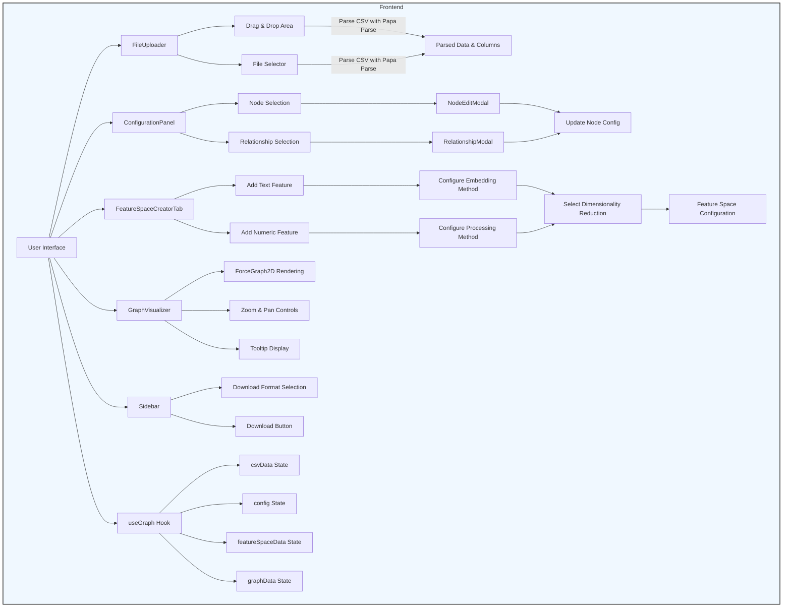
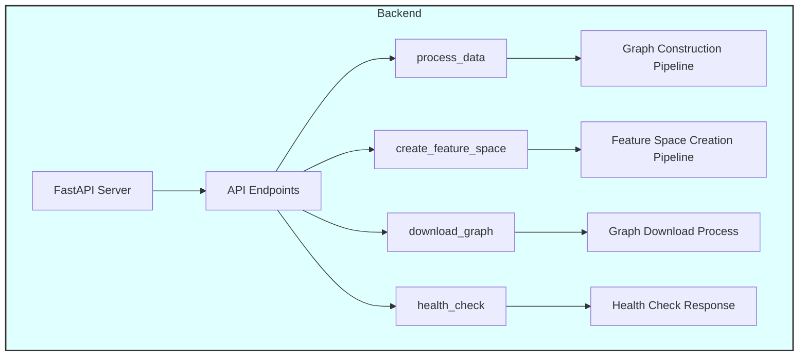
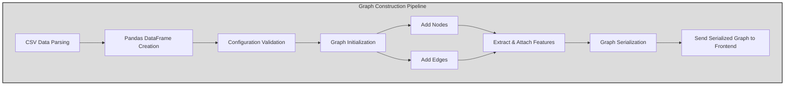
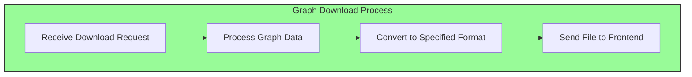
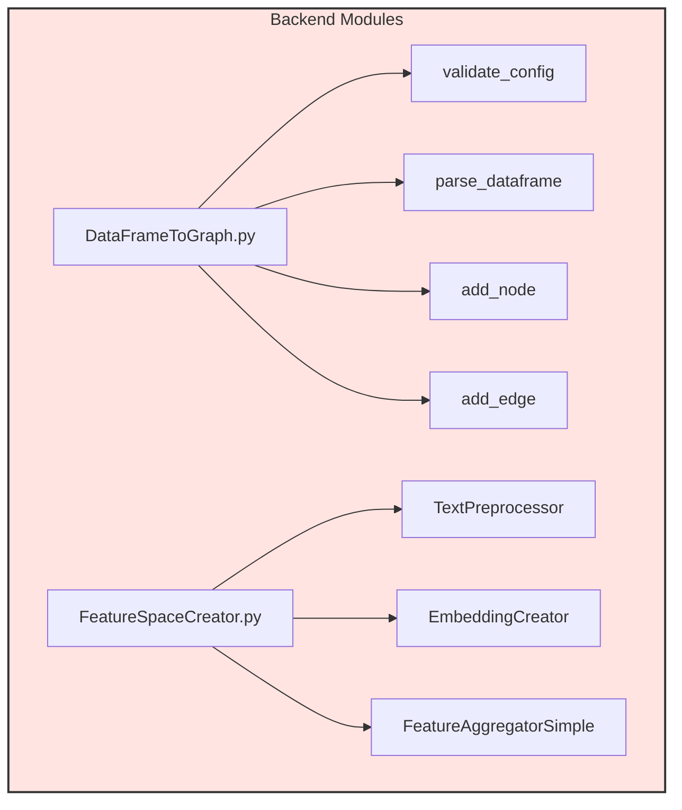

# CSV to Graph Application

An advanced web application that transforms CSV data into interactive graph visualizations. It allows users to configure nodes and relationships, create feature spaces using state-of-the-art embedding techniques, and visualize complex data structures interactively.

## Table of Contents

- [CSV to Graph Application](#csv-to-graph-application)
  - [Table of Contents](#table-of-contents)
  - [Introduction](#introduction)
  - [Features](#features)
  - [Architecture](#architecture)
    - [Frontend](#frontend)
    - [Backend](#backend)
  - [Data Processing Pipelines](#data-processing-pipelines)
    - [Graph Construction Pipeline](#graph-construction-pipeline)
    - [Feature Space Creation Pipeline](#feature-space-creation-pipeline)
  - [Installation](#installation)
    - [Backend Setup](#backend-setup)
    - [Frontend Setup](#frontend-setup)
  - [Usage](#usage)
    - [Running the Application](#running-the-application)
    - [Uploading CSV Data](#uploading-csv-data)
    - [Configuring Nodes and Relationships](#configuring-nodes-and-relationships)
    - [Creating Feature Spaces](#creating-feature-spaces)
    - [Visualizing the Graph](#visualizing-the-graph)
    - [Downloading the Graph](#downloading-the-graph)
  - [Using the Application with the React Framework](#using-the-application-with-the-react-framework)
    - [Prerequisites](#prerequisites)
    - [Folder Structure Overview](#folder-structure-overview)
    - [Key Components and Their Roles](#key-components-and-their-roles)
    - [Setting Up the React Frontend](#setting-up-the-react-frontend)
    - [Utilizing Key React Components](#utilizing-key-react-components)
      - [1. **FileUploader**](#1-fileuploader)
      - [2. **ConfigurationPanel**](#2-configurationpanel)
      - [3. **FeatureSpaceCreatorTab**](#3-featurespacecreatortab)
      - [4. **GraphVisualizer**](#4-graphvisualizer)
      - [5. **Sidebar**](#5-sidebar)
    - [Managing State with `useGraph` Hook](#managing-state-with-usegraph-hook)
    - [Interacting with the Backend API](#interacting-with-the-backend-api)
    - [Extending the React Frontend](#extending-the-react-frontend)
    - [Best Practices](#best-practices)
    - [Troubleshooting](#troubleshooting)
    - [Building for Production](#building-for-production)
    - [Contributing to the React Frontend](#contributing-to-the-react-frontend)
  - [API Endpoints](#api-endpoints)
  - [Project Structure](#project-structure)
  - [Development and Debugging](#development-and-debugging)
    - [Testing the Pipelines](#testing-the-pipelines)
  - [Contributing](#contributing)
  - [License](#license)
  - [Additional Technical Details](#additional-technical-details)
    - [Data Flow](#data-flow)
    - [Module Details](#module-details)
    - [Important Classes and Functions](#important-classes-and-functions)
    - [Error Handling](#error-handling)
    - [Performance Considerations](#performance-considerations)
  - [Pipeline](#pipeline)
    - [Frontend Section](#frontend-section)
    - [Backend Section](#backend-section)
    - [Graph Construction Pipeline](#graph-construction-pipeline-1)
    - [Feature Space Creation Pipeline](#feature-space-creation-pipeline-1)
    - [Graph Download Process](#graph-download-process)
    - [Backend Modules](#backend-modules)

---

## Introduction

This application is designed for data scientists and developers who need to convert CSV data into graph structures for analysis and visualization. By leveraging modern NLP and graph processing libraries, it provides a flexible platform for exploring relationships within data.

## Features

- **CSV Parsing and Validation**: Robust parsing of CSV files with error handling and data validation.
- **Dynamic Node and Relationship Configuration**: Users can specify how columns map to nodes and relationships.
- **Interactive Graph Configuration**: Utilize React Flow for node-based UIs to configure graph components visually.
- **Feature Space Creation**: Generate high-dimensional feature spaces using text embeddings (BERT, GloVe, Word2Vec) and numeric data processing.
- **Dimensionality Reduction**: Apply PCA or UMAP for reducing embeddings to lower dimensions.
- **Graph Visualization**: Interactive 2D visualization using ForceGraph with support for large datasets.
- **Graph Export**: Download the generated graph in formats like GraphML, GEXF, or GML for use in other tools.
- **Scalable Architecture**: Backend designed with FastAPI for high performance and scalability.

---

## Architecture

### Frontend

- **React**: The core framework for building the user interface.
- **React Flow Renderer**: Used for the interactive graph configurator, allowing users to visually create and edit nodes and edges.
- **React Force Graph**: For rendering the final graph visualization interactively.
- **State Management**: Uses React hooks and custom hooks (`useGraph`) for managing application state and data flow.
- **CSS Variables and Responsive Design**: Dark mode and responsive layouts are achieved using CSS variables and media queries.

### Backend

- **FastAPI**: Provides a high-performance web server with asynchronous capabilities.
- **Data Processing Modules**:
  - **DataFrameToGraph**: Converts pandas DataFrames into NetworkX graphs based on user configurations.
  - **FeatureSpaceCreator**: Handles the creation of feature spaces using advanced NLP models and numeric processing.
- **Machine Learning Libraries**:
  - **PyTorch**: For embedding models and any neural network computations.
  - **Transformers**: For BERT embeddings.
  - **Gensim**: For Word2Vec embeddings.
  - **TorchText**: For GloVe embeddings.
- **Graph Libraries**:
  - **NetworkX**: Used for graph creation, manipulation, and export.
  - **Matplotlib (Optional)**: For graph visualization within the backend (e.g., during debugging).

---

## Data Processing Pipelines

### Graph Construction Pipeline

1. **CSV Data Parsing**:
   - The backend receives CSV data as a list of dictionaries.
   - Pandas DataFrame is created from the CSV data.

2. **Configuration Validation**:
   - The configuration provided by the user is validated to ensure all required keys (`nodes`, `relationships`, `graph_type`) are present.

3. **Graph Initialization**:
   - A NetworkX graph is initialized (`MultiDiGraph` for directed graphs or `MultiGraph` for undirected).

4. **Node and Edge Addition**:
   - Nodes are added to the graph based on the `nodes` configuration.
   - Edges are added based on the `relationships` configuration.
   - Features are extracted and attached to nodes and edges.

5. **Graph Serialization**:
   - The constructed graph is serialized into a node-link JSON format using `networkx.readwrite.json_graph.node_link_data`.

6. **Response to Frontend**:
   - The serialized graph is sent back to the frontend for visualization.

### Feature Space Creation Pipeline

1. **Feature Configuration Parsing**:
   - The backend parses the feature configuration to identify text and numeric features.

2. **Text Feature Processing**:
   - **Text Preprocessing**:
     - Tokenization using spaCy or a custom tokenizer.
     - Removal of stopwords, special characters, and handling of casing.
   - **Embedding Generation**:
     - Depending on the specified method (BERT, GloVe, Word2Vec), embeddings are generated for each text feature.
     - For BERT, uses `transformers` library to generate contextual embeddings.
     - For GloVe and Word2Vec, uses pre-trained embeddings or trains on the provided data.

3. **Numeric Feature Processing**:
   - Handles data type conversion, missing value imputation, and scaling (standardization or normalization).

4. **Dimensionality Reduction**:
   - Optional application of PCA or UMAP to reduce high-dimensional embeddings to a lower dimension.

5. **Feature Aggregation**:
   - Combines text and numeric features into a consolidated feature space.
   - Uses custom PyTorch modules to aggregate features if necessary.

6. **Feature Space Serialization**:
   - The final feature space is converted to JSON format and sent back to the frontend.

---

## Installation

### Backend Setup

1. **Clone the Repository**

   ```bash
   git clone https://github.com/MaLoskins/GNN_Application.git
   cd GNN_Application/my-app-backend
   ```

2. **Create a Virtual Environment**

   ```bash
   python3 -m venv venv # On Windows use `python -m venv venv`
   source venv/bin/activate  # On Windows use `venv\Scripts\activate`
   ```

3. **Install Python Dependencies**

   ```bash
   pip install -r requirements.txt
   ```

   *Note: Ensure `requirements.txt` includes all necessary packages.*

4. **Install spaCy Language Model**

   ```bash
   python -m spacy download en_core_web_sm
   ```

5. **Set Up Logging Directory**

   ```bash
   mkdir logs
   ```

6. **Start the Backend Server**

   ```bash
   uvicorn main:app --host 0.0.0.0 --port 8000 --reload
   ```

### Frontend Setup

1. **Navigate to the Frontend Directory**

   ```bash
   cd ../my-app
   ```

2. **Install Node Dependencies**

   ```bash
   npm install
   ```

3. **Start the Frontend Development Server**

   ```bash
   npm start
   ```

   *Note: The frontend server runs on `http://localhost:3000`.*

---

## Usage

### Running the Application

- **Ensure both backend and frontend servers are running.**
- Access the application via `http://localhost:3000`.

### Uploading CSV Data

- Use the **FileUploader** component to drag and drop or select a CSV file.
- The frontend parses the CSV using `Papa Parse` and extracts data and columns.
- Data is stored in the application state using React hooks.

### Configuring Nodes and Relationships

- In the **ConfigurationPanel**, select columns to represent as nodes.
- Use the **ReactFlowWrapper** to visually connect nodes, creating edges.
- **NodeEditModal** allows editing node types and assigning features.
- **RelationshipModal** is used to define relationship types and assign features to edges.

### Creating Feature Spaces

- Switch to the **Feature Space Creator** tab.
- **FeatureSpaceCreatorTab** allows adding multiple features with detailed configurations.
- Supports text features with embedding methods (BERT, GloVe, Word2Vec) and dimensionality reduction.
- Supports numeric features with processing methods and optional projection.

### Visualizing the Graph

- After processing, the **GraphVisualizer** component renders the graph using **ForceGraph2D**.
- Nodes and edges are color-coded based on types.
- Interactivity includes zooming, panning, and tooltip displays.

### Downloading the Graph

- Use the **Sidebar** component to select the download format.
- The **downloadGraph** API endpoint generates the graph in the desired format.
- The graph file is downloaded directly from the browser.

---

## Using the Application with the React Framework

This section provides a comprehensive guide on how to utilize and extend the frontend of the **CSV to Graph Application** built with the **React** framework. Whether you're a developer looking to customize the user interface or integrate additional features, this guide will help you navigate the React components and structure effectively.

### Prerequisites

- **Node.js** (v14 or later)
- **npm** (v6 or later) or **yarn**
- Basic knowledge of **React** and **JavaScript**

### Folder Structure Overview

Understanding the folder structure is crucial for efficient development and maintenance. Here's a brief overview of the **`my-app`** directory:

```
my-app/
├── src/
│   ├── components/
│   │   ├── ConfigurationPanel/
│   │   ├── FeatureSpaceCreatorTab/
│   │   ├── FileUploader/
│   │   ├── GraphVisualizer/
│   │   ├── NodeEditModal/
│   │   ├── ReactFlowWrapper/
│   │   ├── RelationshipModal/
│   │   └── Sidebar/
│   ├── hooks/
│   │   └── useGraph.js
│   ├── utils/
│   │   └── validation.js
│   ├── api.js
│   ├── App.js
│   └── index.js
├── public/
├── package.json
└── ...
```

### Key Components and Their Roles

- **`components/`**: Contains all React components used in the application.
  - **`ConfigurationPanel/`**: Manages the configuration of nodes and relationships.
  - **`FeatureSpaceCreatorTab/`**: Handles the creation and configuration of feature spaces.
  - **`FileUploader/`**: Facilitates CSV file uploads.
  - **`GraphVisualizer/`**: Renders the interactive graph visualization.
  - **`NodeEditModal/`**: Modal for editing node properties.
  - **`ReactFlowWrapper/`**: Integrates React Flow for interactive graph configuration.
  - **`RelationshipModal/`**: Modal for defining relationships between nodes.
  - **`Sidebar/`**: Provides options for downloading the graph and other sidebar functionalities.
  
- **`hooks/`**:
  - **`useGraph.js`**: Custom React hook for managing graph-related state and logic.
  
- **`utils/`**:
  - **`validation.js`**: Utility functions for validating user inputs and configurations.
  
- **`api.js`**: Handles API interactions with the backend using Axios.
  
- **`App.js`**: The root component that assembles all other components.
  
- **`index.js`**: Entry point for the React application.

### Setting Up the React Frontend

Follow these steps to set up and run the React frontend of the application:

1. **Navigate to the Frontend Directory**

   ```bash
   cd my-app
   ```

2. **Install Node Dependencies**

   Ensure you have all the necessary packages installed. You can use either `npm` or `yarn`.

   ```bash
   npm install
   # or
   yarn install
   ```

3. **Start the Development Server**

   Launch the React development server to run the application locally.

   ```bash
   npm start
   # or
   yarn start
   ```

   The application should now be accessible at `http://localhost:3000`.

### Utilizing Key React Components

Below are descriptions and usage guidelines for some of the key React components in the application:

#### 1. **FileUploader**

- **Path**: `src/components/FileUploader/FileUploader.js`
- **Purpose**: Allows users to upload CSV files via drag-and-drop or file selection.
- **Props**:
  - `onFileUpload`: Callback function triggered after a successful file upload and parsing.

#### 2. **ConfigurationPanel**

- **Path**: `src/components/ConfigurationPanel/ConfigurationPanel.js`
- **Purpose**: Enables users to configure nodes and relationships based on the uploaded CSV data.
- **Props**:
  - `config`: Current configuration state.
  - `setConfig`: Function to update the configuration state.

#### 3. **FeatureSpaceCreatorTab**

- **Path**: `src/components/FeatureSpaceCreatorTab/FeatureSpaceCreatorTab.js`
- **Purpose**: Facilitates the creation and configuration of feature spaces using various embedding techniques.
- **Props**:
  - `featureSpace`: Current feature space configuration.
  - `setFeatureSpace`: Function to update the feature space configuration.

#### 4. **GraphVisualizer**

- **Path**: `src/components/GraphVisualizer/GraphVisualizer.js`
- **Purpose**: Renders the interactive graph using **React Force Graph**.
- **Props**:
  - `graphData`: The serialized graph data to visualize.

#### 5. **Sidebar**

- **Path**: `src/components/Sidebar/Sidebar.js`
- **Purpose**: Provides options for downloading the graph and other sidebar functionalities.
- **Props**:
  - `onDownload`: Callback function triggered when the user initiates a graph download.

### Managing State with `useGraph` Hook

The `useGraph` custom hook centralizes the state management for graph-related data and configurations.

- **Path**: `src/hooks/useGraph.js`
- **Features**:
  - Manages states such as `csvData`, `config`, `featureSpaceData`, and `graphData`.
  - Provides handler functions for file uploads, node selections, submissions, and feature space configurations.

### Interacting with the Backend API

All API interactions are managed through the **`api.js`** file using **Axios**.

- **Path**: `src/api.js`
- **Functions**:
  - `processData`: Sends CSV data and configurations to the backend for graph processing.
  - `createFeatureSpace`: Sends feature configurations to generate the feature space.
  - `downloadGraph`: Requests the backend to generate and download the graph in the desired format.

### Extending the React Frontend

To add new features or modify existing ones, follow these guidelines:

1. **Creating New Components**

   - **Location**: `src/components/YourNewComponent/YourNewComponent.js`
   - **Example**:
   - **Styles**: Create a corresponding CSS file `YourNewComponent.css` for styling.

2. **Updating State Management**

   - Modify the `useGraph` hook if the new component requires managing additional state or handling new actions.

3. **Integrating with Existing Components**

   - Import and use the new component within `App.js` or other existing components as needed.

4. **API Integration**

   - If the new component requires additional backend interactions, update `api.js` with new API functions and ensure the backend has corresponding endpoints.

### Best Practices

- **Component Reusability**: Design components to be reusable and modular to facilitate maintenance and scalability.
- **State Management**: Utilize React hooks effectively to manage state and side effects. Keep the `useGraph` hook organized to handle complex state logic.
- **Styling**: Maintain consistent styling using CSS modules or styled-components to ensure a uniform look and feel across the application.
- **Error Handling**: Implement robust error handling in components to provide meaningful feedback to users and simplify debugging.
- **Documentation**: Comment your code and update the README as you add new features to help other developers understand your changes.

### Troubleshooting

- **Common Issues**:
  - **Dependency Errors**: Ensure all required dependencies are installed. Run `npm install` or `yarn install` if you encounter missing packages.
  - **Port Conflicts**: If `localhost:3000` is in use, specify a different port when starting the development server:
    ```bash
    PORT=3001 npm start
    # or on Windows
    set PORT=3001 && npm start
    ```
  - **API Connectivity**: Verify that the backend server is running and accessible. Check proxy settings in `package.json` if necessary.

- **Debugging Tips**:
  - Use **React Developer Tools** in your browser to inspect component hierarchies and state.
  - Check the browser console for any runtime errors or warnings.
  - Utilize **VS Code** or your preferred IDE's debugging features to set breakpoints and step through code.

### Building for Production

To create an optimized production build of the React frontend:

1. **Navigate to the Frontend Directory**

   ```bash
   cd my-app
   ```

2. **Build the Application**

   ```bash
   npm run build
   # or
   yarn build
   ```

   This will generate a `build/` directory containing the optimized production files.

3. **Serve the Build**

   You can serve the build using a static server or integrate it with your backend deployment.

   ```bash
   npm install -g serve
   serve -s build
   ```

   The application will be available at `http://localhost:5000` by default.

### Contributing to the React Frontend

If you wish to contribute to the frontend development:

1. **Fork the Repository**

   ```bash
   git clone https://github.com/MaLoskins/GNN_Application.git
   cd GNN_Application/my-app
   ```

2. **Create a New Branch**

   ```bash
   git checkout -b feature/your-feature-name
   ```

3. **Make Your Changes**

   Implement your feature or fix in the appropriate components or hooks.

4. **Commit and Push**

   ```bash
   git add .
   git commit -m "Add feature XYZ"
   git push origin feature/your-feature-name
   ```

5. **Open a Pull Request**

   Navigate to the repository on GitHub and open a pull request for your branch.

## API Endpoints

- **GET `/`**
  - Health check endpoint.
- **POST `/process-data`**
  - **Request**: JSON containing `data`, `config`, and optional `featureSpaceData`.
  - **Response**: Serialized graph data in node-link format.
- **POST `/create-feature-space`**
  - **Request**: JSON containing `data` and `config`.
  - **Response**: Feature space data with features and settings.
- **POST `/download-graph`**
  - **Request**: JSON containing `data`, `config`, `featureSpaceData`, and `format`.
  - **Response**: Graph file in the specified format.

---

## Project Structure

```
GNN_Application/
├── my-app/
│   ├── src/
│   │   ├── components/
│   │   │   ├── ConfigurationPanel/
│   │   │   ├── FeatureSpaceCreatorTab/
│   │   │   ├── FileUploader/
│   │   │   ├── GraphVisualizer/
│   │   │   ├── NodeEditModal/
│   │   │   ├── ReactFlowWrapper/
│   │   │   ├── RelationshipModal/
│   │   │   └── Sidebar/
│   │   ├── hooks/
│   │   │   └── useGraph.js
│   │   ├── utils/
│   │   │   └── validation.js
│   │   ├── api.js
│   │   ├── App.js
│   │   └── index.js
│   ├── public/
│   ├── package.json
│   └── ...
├── my-app-backend/
│   ├── main.py
│   ├── DataFrameToGraph.py
│   ├── FeatureSpaceCreator.py
│   ├── Process_Data.py
│   ├── requirements.txt
│   └── logs/
└── README.md
```

---

| Category   | Dependencies                                                                 |
|------------|------------------------------------------------------------------------------|
| **Backend**  | FastAPI, Uvicorn, Pandas, NetworkX, PyTorch, Transformers, Gensim, TorchText, spaCy, UMAP-learn, Scikit-learn |
| **Frontend** | React, React Flow Renderer, React Dropzone, React Modal, React Force Graph, Papa Parse, Axios, React Icons  |

---

## Development and Debugging

- **Logging**: Backend logs are stored in the `logs` directory.
- **Debugging Backend**:
  - Use log files (`data_to_graph.log`, `feature_space_creator.log`) for tracing issues.
  - Ensure correct versions of language models and embeddings are installed.
- **Debugging Frontend**:
  - Use browser developer tools to inspect network requests and console logs.
  - Check React component states using React Developer Tools.

### Testing the Pipelines

- **Graph Construction**:
  - Test with simple CSV files to ensure nodes and edges are correctly added.
  - Verify the graph serialization by inspecting the JSON response.

- **Feature Space Creation**:
  - Start with a single text feature using BERT embeddings to validate the pipeline.
  - Check embedding dimensions and ensure dimensionality reduction is applied correctly.
  - For numeric features, test processing methods and projections.

---

## Contributing

1. **Fork the Repository**

   ```bash
   git clone https://github.com/MaLoskins/GNN_Application.git
   cd GNN_Application
   ```

2. **Create a New Branch**

   ```bash
   git checkout -b feature/your-feature-name
   ```

3. **Make Your Changes**

4. **Commit and Push**

   ```bash
   git add .
   git commit -m "Add detailed description of your changes"
   git push origin feature/your-feature-name
   ```

5. **Open a Pull Request**

---

## License

This project is licensed under the MIT License - see the [LICENSE](LICENSE) file for details.

---

## Additional Technical Details

### Data Flow

1. **Frontend Data Flow**:
   - User uploads CSV file.
   - CSV data is parsed and stored in state (`csvData`, `columns`).
   - User interactions update the `config` state.
   - Graph configurations are managed using the `useGraph` custom hook.
   - Upon submission, data and configurations are sent to the backend.

2. **Backend Data Flow**:
   - Receives data and configurations via API endpoints.
   - Processes data using pandas and custom modules.
   - Returns processed data or files to the frontend.

### Module Details

- **DataFrameToGraph.py**:
  - **Purpose**: Converts tabular data into a graph structure based on user-defined configurations.
  - **Key Functions**:
    - `_validate_config()`: Ensures the configuration dictionary contains all necessary keys and values.
    - `_parse_dataframe()`: Iterates through the DataFrame to add nodes and edges to the graph.
    - `_add_node()`: Adds nodes to the graph, handling duplicate nodes and merging features.
    - `_add_edge()`: Adds edges between nodes, handling edge types and features.
  - **Logging**: Uses the `logging` module to record warnings and errors during processing.

- **FeatureSpaceCreator.py**:
  - **Purpose**: Generates a feature space from text and numeric data, applying embeddings and processing as specified.
  - **Components**:
    - **TextPreprocessor**: Cleans and tokenizes text data using spaCy, with options to remove stopwords and special characters.
    - **EmbeddingCreator**: Handles the generation of embeddings for text data using BERT, GloVe, or Word2Vec.
    - **FeatureAggregatorSimple**: A PyTorch module to aggregate sentence embeddings with other features.
  - **Processing Steps**:
    - **Text Features**:
      - Tokenization and cleaning.
      - Embedding generation.
      - Optional dimensionality reduction (PCA, UMAP).
    - **Numeric Features**:
      - Scaling (standardization, normalization).
      - Optional projection using linear layers.
  - **Logging**: Detailed logging of each step, including any exceptions or issues encountered.

- **useGraph.js**:
  - **Purpose**: A custom React hook that manages the state and logic related to graph construction on the frontend.
  - **Key Functions**:
    - `handleFileDrop()`: Initializes state when a new CSV file is uploaded.
    - `handleSelectNode()`: Updates the configuration and state when a node is selected or deselected.
    - `handleSubmit()`: Sends data and configurations to the backend to process the graph.
    - `handleFeatureSpaceSubmit()`: Sends data and feature configurations to the backend to create the feature space.
    - Event handlers for React Flow components to manage node and edge interactions.

### Important Classes and Functions

- **ReactFlowWrapper.js**:
  - Wraps the React Flow component to provide a customizable interface for the graph configurator.
  - Manages events such as node clicks, node dragging, and edge connections.

- **api.js**:
  - Contains functions for interacting with the backend API using Axios.
  - Handles requests to endpoints like `/process-data`, `/create-feature-space`, and `/download-graph`.

- **GraphVisualizer.js**:
  - Uses `react-force-graph-2d` to render the final graph.
  - Configures node and link properties, including labels, colors, and sizes.

### Error Handling

- **Frontend**:
  - Validates user inputs in forms to prevent invalid configurations.
  - Uses `alert()` to inform users of errors during processing.
  - Catches exceptions during API calls and logs them to the console.

- **Backend**:
  - Uses `try-except` blocks to handle exceptions in API endpoints.
  - Returns informative HTTP error responses with status codes and messages.
  - Logs errors and warnings to files for troubleshooting.

### Performance Considerations

- **Asynchronous Processing**:
  - Backend endpoints are designed to handle requests asynchronously, improving responsiveness.

- **Caching and Resource Management**:
  - For repeated operations, consider implementing caching mechanisms in future versions.
  - Monitor resource usage during embedding computations, especially with large datasets.

---

## Pipeline

### Frontend Section



### Backend Section



### Graph Construction Pipeline



### Feature Space Creation Pipeline



```mermaid
graph TD
    %% Feature Space Creation Pipeline
    subgraph Feature_Space_Creation_Pipeline [Feature Space Creation Pipeline]
        FC1[Feature Configuration Parsing]
        FC1 --> FC2[Text Feature Processing]
        FC1 --> FC3[Numeric Feature Processing]
        
        %% Text Feature Processing
        subgraph Text_Feature_Processing [Text Feature Processing]
            FC2 --> FC2_1[Text Preprocessing]
            FC2_1 --> FC2_2[Tokenization]
            FC2_2 --> FC2_3[Stopwords Removal]
            FC2_3 --> FC2_4[Special Characters Handling]
            FC2_4 --> FC2_5[Embedding Generation]
            FC2_5 --> FC2_6[Select Embedding Method]
            FC2_6 --> FC2_7[BERT Embeddings]
            FC2_6 --> FC2_8[GloVe Embeddings]
            FC2_6 --> FC2_9[Word2Vec Embeddings]
        end
        
        %% Numeric Feature Processing
        subgraph Numeric_Feature_Processing [Numeric Feature Processing]
            FC3 --> FC3_1[Data Type Conversion]
            FC3_1 --> FC3_2[Missing Value Imputation]
            FC3_2 --> FC3_3[Scaling]
        end
        
        %% Continue Feature Space Creation Pipeline
        FC2_7 --> FC4[Dimensionality Reduction]
        FC2_8 --> FC4
        FC2_9 --> FC4
        FC4 --> FC5[Apply PCA/UMAP]
        FC5 --> FC6[Combine Text & Numeric Features]
        FC6 --> FC7[Feature Aggregation]
        FC7 --> FC8[Feature Space Serialization]
        FC8 --> FC9[Send Feature Space Data to Frontend]
    end
    
    %% Styling
    classDef pipeline fill:#fafad2,stroke:#333,stroke-width:2px;
    class Feature_Space_Creation_Pipeline pipeline;
```

### Graph Download Process



### Backend Modules


